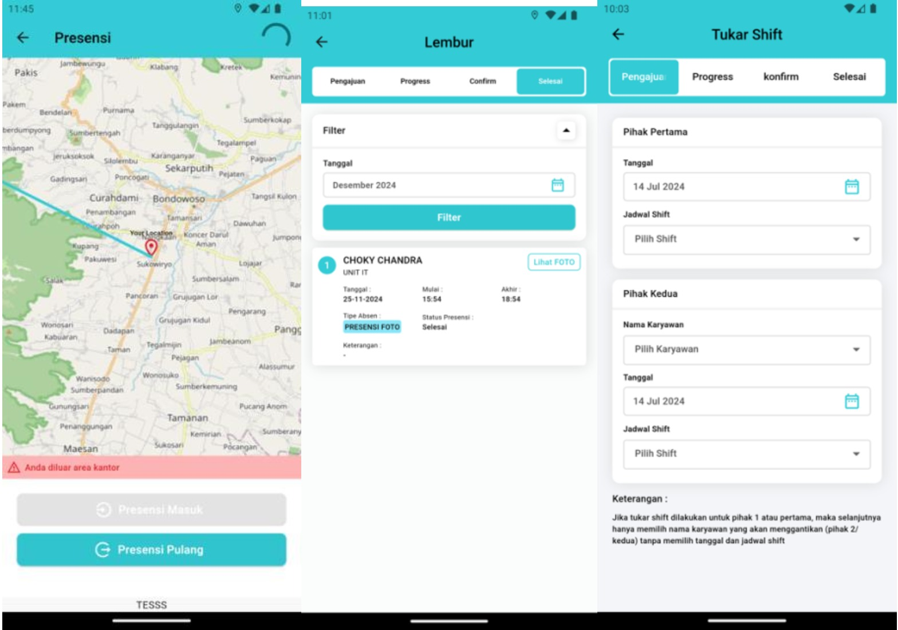

<div align="center">
  
  
  <h1>🏥 Graha Sehat Hospital - Smart Attendance App</h1>
  <p>A highly secure, location-based mobile attendance system built with Flutter.</p>

  <p>
    
    
    
  </p>
</div>

## 📖 About The Project

**Presensi GS** is a specialized mobile attendance application developed for Graha Sehat Hospital. It ensures accurate employee time-tracking using precise GPS geofencing (radius detection). 

To maintain high data integrity and prevent attendance fraud, this application is equipped with strict security measures, including **Fake GPS (Mock Location) detection**, device rooting/jailbreak checks, and Network Time Protocol (NTP) validation to prevent manual time manipulation.

## ✨ Key Features

* 📍 **Geofencing & Radius Detection:** Employees can only clock in/out if they are within the designated hospital radius.
* 🛡️ **Anti-Fraud & Security System:** * Detects and blocks Mock Locations (Fake GPS).
  * Prevents usage on Rooted/Jailbroken devices.
  * Validates device time against internet servers using NTP to prevent local time manipulation.
* 📸 **Camera / Selfie Verification:** In-app camera integration for photo-proof attendance.
* 📊 **Interactive Dashboard & Statistics:** Visualizes employee attendance data and performance using interactive charts (Pie charts, Fl charts, and Percent Indicators).
* 🗺️ **Custom Map Integration:** Displays precise employee locations using `flutter_map` (OpenStreetMap) and `latlong2`.
* 📁 **Document Submission:** Employees can attach and submit leave or medical certificates using the file picker.

## 🛠️ Tech Stack & Architecture

This project leverages modern Flutter libraries to ensure high performance and maintainability:

* **State Management & Routing:** [`get`](https://pub.dev/packages/get) (GetX)
* **API Integration:** [`http`](https://pub.dev/packages/http) for secure REST API communication.
* **Security & Device Identity:** * [`safe_device`](https://pub.dev/packages/safe_device) (Fake GPS & Root detection)
  * [`ntp`](https://pub.dev/packages/ntp) (Real-time network validation)
  * [`device_info_plus`](https://pub.dev/packages/device_info_plus) & [`dart_ipify`](https://pub.dev/packages/dart_ipify)
* **Location & Mapping:** [`location`](https://pub.dev/packages/location), [`flutter_map`](https://pub.dev/packages/flutter_map), [`latlong2`](https://pub.dev/packages/latlong2)
* **UI/UX & Data Visualization:** [`fl_chart`](https://pub.dev/packages/fl_chart), [`pie_chart`](https://pub.dev/packages/pie_chart), [`shimmer`](https://pub.dev/packages/shimmer)
* **Local Storage:** [`shared_preferences`](https://pub.dev/packages/shared_preferences) for caching auth tokens securely.

## 📱 Screenshots

<div align="center">
  
  
  
  
</div>

## 🚀 Getting Started

### Prerequisites
* Flutter SDK: `>=3.2.6 <4.0.0`
* Dart SDK
* An active REST API backend to handle attendance POST requests.

### Installation

1. Clone the repo:
   ```sh
   git clone [https://github.com/Rhomaedy1201/presensi_gs.git](https://github.com/Rhomaedy1201/presensi_gs.git)
